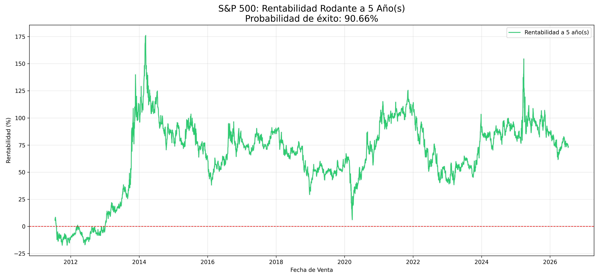

# Análisis de Activos Financieros: S&P 500 Rolling Returns 📈

Script en Python que analiza la probabilidad de éxito al invertir en el S&P 500 según el horizonte temporal. Utiliza yfinance para la extracción de datos y matplotlib para la visualización.

Cómo usarlo: pip install -r requirements.txt y luego python main.py.
